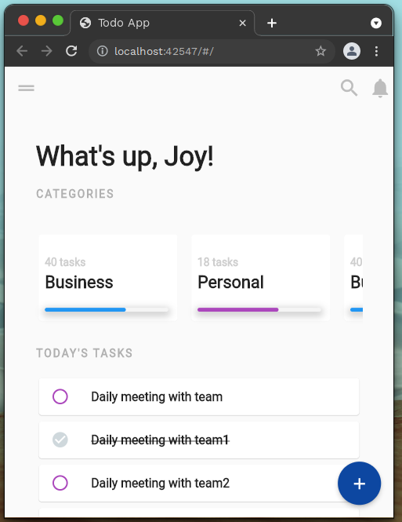
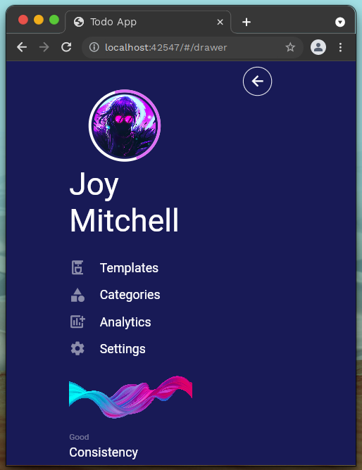
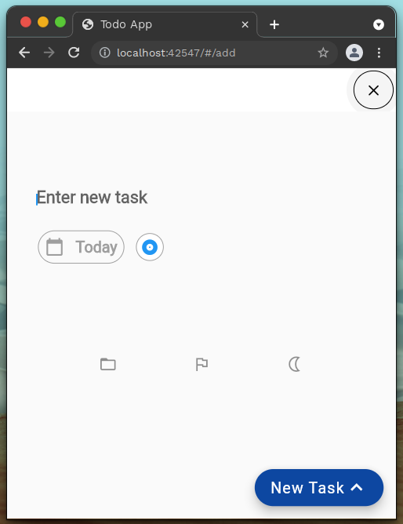

<h1 align="center">
  <br>
  Todo App (Template) - Simple & Beautiful
  <br>
</h1>

<h4 align="center">A minimal and beautifully designed Todo mobile app made using Flutter</h4>


<p float="left">
  
  
  

</p>

## Key Features

* Easily add and remove tasks
* Task analysis.
* Organize tasks under categories. Editing.

## Installation & How To Use

```bash
# Clone this repository
$ git clone https://github.com/alii76tt/flutter-todo-template
# Go into the repository
$ cd flutter-todo-template
# Install dependencies
$ flutter pub get
# Run the app
$ flutter run
```

## Design
- [Draw Page](https://github.com/necatichdar)
- [Add Page](https://github.com/ozgeerdogan)
- [Home Page](https://github.com/alii76tt)
